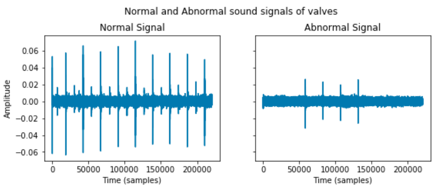
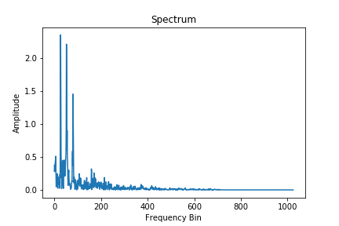
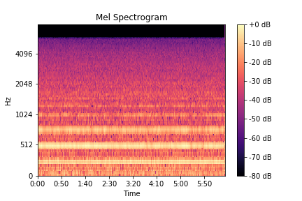
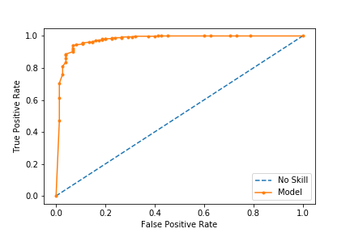
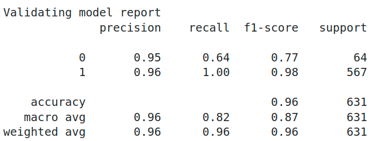

# Anomally-detection-of-industrial-machines-part-1
  ## (For predictive maintenance)
## Description
This project is a part of the Becode.org AI Bootcamp programme. The goal is to produce a supervised classifier for anomalous sound detection in industrial machines for a fictional company Acme Corporation. Data samples of normal and abnormal sounds of valves, pumps, fans and sliders are provided. 

## Objectives

- Be able to work and process data from audio format
- Find insights from data, build hypothesis and define conclusions
- Build machine learning models for predictive classification and/or regression
- Select the right performance metrics for your model
- Evaluate the distribution of data points and evaluate its influence in the model
- Be able to identify underfitting or overfitting that might exist on the model
- Tuning parameters of the model for better performance
- Select the model with better performance and following your customer's requirements
- Define the strengths and limitations of the model

## Explorative data analysis
Acoustic data samples for 4 machine elements are given. Audio samples are recorded at three different signal to noise ratios (-6dB, 0dB, 6dB). Initial analysis is based on 6dB. This is because there is less noise in the data as compared to the other recordings. In addition, there are 4 models per each machine element. Moreover, it has been noticed that the data for abnormal sounds is undersampled.

 

## Feature Extraction and results
The features used to train the ML model are Mel Frequency Cepstral Coefficents (MFCCs). They are features that combine the time-domain and frequency domain features of the sound wave. The MFCC uses the MEL scale to divide the frequency band to sub-bands and then extracts the Cepstral Coefficents using Discrete Cosine Transform (DCT). MEL scale is based on the way humans distinguish between frequencies which makes it very convenient to process sounds.

The AI model was trained with 70% of the data, 15% of data used for testing, and 15% for validation. Different classifier algorithms were explored. Using RandomForestClassifier, weighted average F1-score of 0.96 was achieved.

### Strengths

- The model works for all the types of machines with acceptable accuracy.
- The model provides intial insights to detect abnormalities.

### Limitations

- Undersampled examples of abnormal sounds
- Overfitting in the current model

### Further Developments

- Finetuning the model per machine
- Trying different machine learning techniques

## Repo Architecture

- *(1) README.md* Project documentation
- *(2) Download folders with audio data.ipynb* A Jupyter Notebook file with code to download data samples from provided resource
- *(3) Create a dataframe with files.ipynb* A Jupyter Notebook file with code to create a dataframe and .csv file with filenames
- *(4) anomaly_files.csv* .csv file with filenames of provided samples
- *(5) Extract feature 6dB machine.ipynb* A Jupyter Notebook file with code to extract features and targets for 6dB samples of all machines 
- *(6) ASD_model.ipynb* A Jupyter Notebook file with code to make a prediction ML model
- *(7) ASD_model.pkl* A pickelised ML model to easily deploy

## Installation

 *git clone* the repo 

## Usage

To use this model run (2) and (3) to collect the data samples and extract the features by running file (5). Next run (6) or use (7) to run a prediction.

## Timeline

The project took 4 working days to write a code and was presented on the 5th day.

## Personal situation

Contributors: [mokegg](https://github.com/mokegg), [kpranke](https://github.com/kpranke)

We are currently participating in the Becode.org AI Bootcamp to upskill into a career in data science.

**[Back to top](#table-of-contents)**
